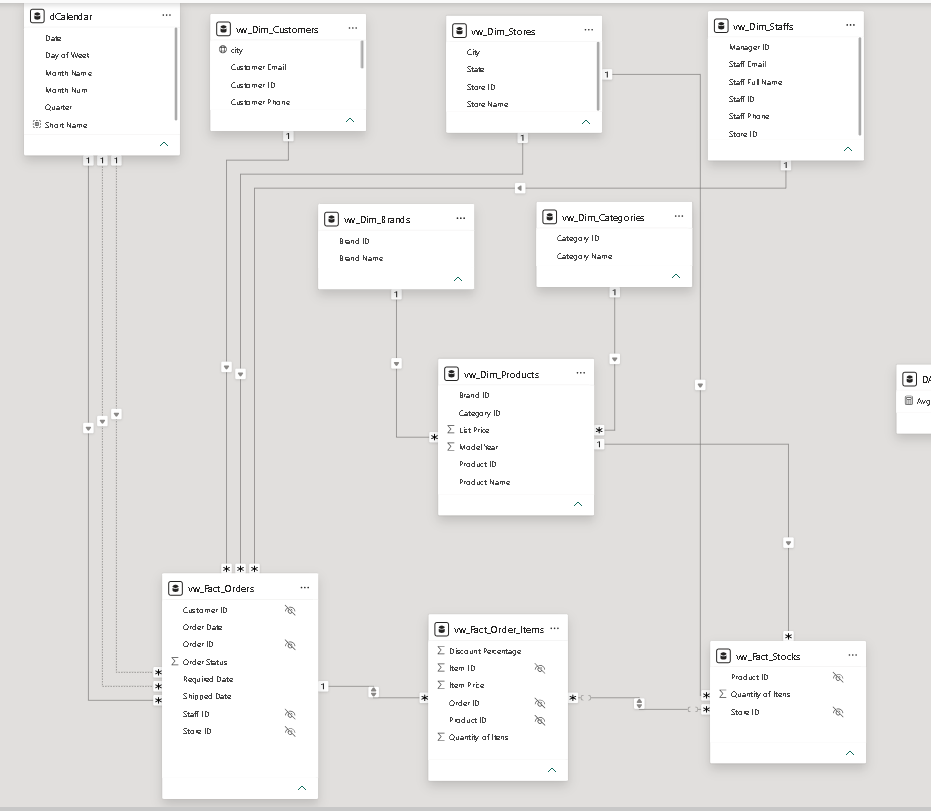

# 🚲 Bike Stores Data Engineering & Architecture

This repository contains a robust, enterprise-grade Business Intelligence and Data Engineering solution developed for a retail network of bicycle stores. The project focuses on relational data abstraction, dimensional modeling, and strategic context handling to deliver a high-performance analytical environment.

> ⚠️ **Note:** This project was developed under a Power BI Desktop license, so a live cloud link is not available. To inspect the architecture, data model, and custom DAX measures, please follow the execution steps detailed below.

---

## 🛠️ Tech Stack & Implementation Details

The project separates the data engineering/preparation layer from the visualization engine to guarantee scalability, performance, and clear business logic rules.

* **SQL Server (Transact-SQL):** Utilized for database reverse engineering, schema abstraction, data cleaning (`CAST`, `CONCAT`, `COALESCE`, `NULLIF`), and compiling optimized analytical views (`vw_...`).
* **Figma:** Used as the UI/UX design platform to architect user-centric layouts, wireframes, and custom dashboard backgrounds, reducing Power BI rendering overhead.
* **Power BI Desktop:** Implemented as the primary analytics engine for semantic model building, relationship configurations, and canvas orchestration.
* **DAX (Data Analysis Expressions):** Engineered to handle advanced calculations and evaluation context manipulation to bypass multi-fact table calculation boundaries (using `CALCULATE`, `SUMX`, `SUMMARIZE`, and `KEEPFILTERS`).

---

## 🏛️ Architecture & Data Modeling

### 🧩 Relational Abstraction via SQL Views
Instead of importing raw operational tables directly into the BI engine, a structural data abstraction layer was built in **SQL Server**. Nine specialized views (`CREATE VIEW`) were developed to streamline performance:
* **Dim Tables:** Standardized dimensions for Stores, Customers, Staffs, Products, Brands, and Categories. These views handle string concatenations (e.g., creating `full_name`) and data cleansing (replacing missing phone/email logs) at the source level.
* **Fact Tables:** Segmented facts handling distinct granularities: Inventory snapshots (`vw_Fact_Stocks`), Order Headers (`vw_Fact_Orders`), and Transactional Details (`vw_Fact_Order_Items`).

### 🕸️ Data Model Blueprint: Galaxy/Star Schema Architecture
The analytical engine is organized under a **Galaxy Schema** (an advanced star-schema layout designed to support multiple, interconnected fact tables sharing dimension tables). 

#### 🔗 Dimensional Relationship Mapping:
Filters propagate efficiently through strict, single-direction (`1:N`) relationships from dimensions down to core facts, maintaining strict isolation of evaluation contexts:
* **Operational Filters:** `vw_Dim_Stores` filters both `vw_Fact_Stocks` and `vw_Fact_Orders` via `store_id`. `vw_Dim_Customers` and `vw_Dim_Staffs` filter `vw_Fact_Orders` via `customer_id` and `staff_id` respectively.
* **Product Hierarchy (Snowflake Abstraction):** `vw_Dim_Brands` and `vw_Dim_Categories` filter `vw_Dim_Products`, which then filters the inventory records in `vw_Fact_Stocks` via `product_id`.
* **Time Intelligence:** A custom `dCalendar` table engineered via Power Query acts as the single chronological source of truth, filtering `vw_Fact_Orders` via the `Date` key.

#### ⚡ Fact-to-Fact Intersections & Cross-Filtering:
* `vw_Fact_Order_Items` acts as the central transaction junction, bridging data directly to `vw_Fact_Orders` via `order_id` and connecting to `vw_Fact_Stocks` through an `N:N` relationship via `product_id`.
* Bi-directional filtering is strategically enabled between these fact boundaries to allow cross-filtering capabilities between inventory availability and real-time sales revenue.

---

## 🎨 UI/UX Design Philosophy
Every dashboard layout was custom-designed using **Figma** before visual development. This approach allowed for:
* **Performance Optimization:** Flat image backgrounds reduce active visual rendering times.
* **Consistent Visual Hierarchy:** Custom-built containers designed specifically for KPI cards, optimizing screen real estate, alignment, and cognitive scanability.

---

## 🚀 How to Run and Inspect the Project

Follow these steps to download the file and review the active relationships, data types, and measures:

### 1. Prerequisites
Ensure you have the following tool installed on your machine:
* [Power BI Desktop](https://powerbi.microsoft.com/desktop/) (Free download from the Microsoft Store).
* *(Optional)* [SQL Server Management Studio (SSMS)](https://learn.microsoft.com/sql/ssms/download-sql-server-management-studio-ssms) to inspect the view generation scripts located in the `data/` folder.

### 2. Running the Project
1. Clone this repository or download the files as a ZIP by clicking on the green **Code** button at the top right, then selecting **Download ZIP**.
2. Navigate to the root folder of the project.
3. Double-click the file named **`Painel de instrumentos da bicicleta.pbix`**.
4. Power BI Desktop will open the project automatically. All data, relational links, and custom DAX measures are fully embedded within the file—**no server connection or data source reconfiguration is required to inspect the environment**.

---

📈 **Looking for business insights?** Check out the full [Executive Analytics Report](./ANALYSIS.md) for a deep dive into sales seasonality, inventory backlogs, and customer behavior trends
